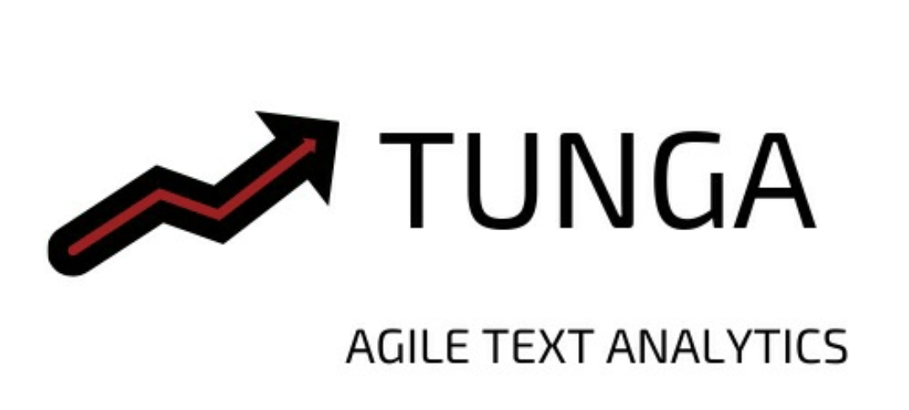
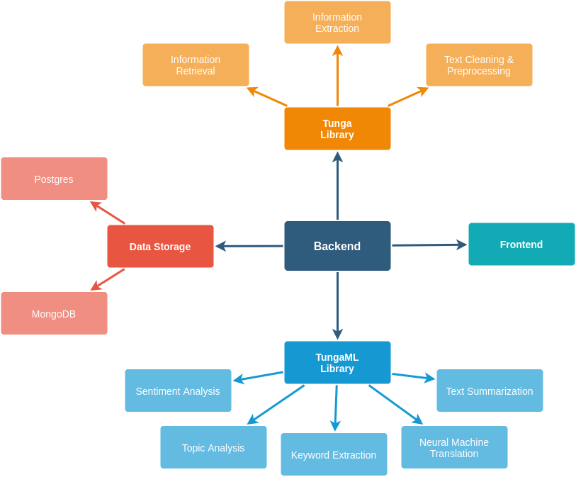

<p align="center">
    
</p>


# [TUNGA: Agile Text Analytics Platform](http://tunga.ml)
Tunga, düzensiz metin veri setlerinden değerli bilgiler üretebilmek için geliştirilmiş ve tüm metin işleme sürecini 
hızlandıran web tabanlı ve açık kaynak bir SaaS uygulamasıdır. 
> Bu proje Açık Kaynak Doğal Dil İşleme Hackathon'u sürecinde
geliştirilmiştir. www.acikhack.com


  

[](https://www.python.org/) [](https://img.shields.io/pypi/pyversions/sadedegel) [](https://pypi.org/project/tunga/) [](https://github.com/GlobalMaksimum/sadedegel/blob/master/LICENSE)
</img>  

## İçindekiler
- [TUNGA: Agile Text Analytics Platform](#tunga-agile-text-analytics-platform)
  - [İçindekiler](#i̇çindekiler)
  - [:question: Problem Tanımı](#question-problem-tanımı)
  - [:gear: Çözüm Önerisi](#gear-çözüm-önerisi)
  - [:dancers: Takım](#dancers-takım)
  - [:house: Projenin Teknik Mimarisi](#house-projenin-teknik-mimarisi)
    - [:book: Kütüphane](#book-kütüphane)
    - [:satellite: Backend](#satellite-backend)
    - [:tada: Frontend](#tada-frontend)
  - [:wrench: Kullanım](#wrench-kullanım)
  - [:construction: Kurulum](#construction-kurulum)
  - [📝 Lisans](#-lisans)

## :question: Problem Tanımı
Doğal dil işleme, sosyal medyanın da etkisiyle artık her kurumun büyük bir ihtiyacı haline gelmiş durumda. Özellikle B2C(İşletmeden tüketiciye)  iş modellerinde müşterileri ve trendleri anlamak kritik bir öneme sahip. Bu bağlamda işletmelerin metin verilerinden öngörüler oluşturmalı ve anlam çıkarmaları gerek. Tüm bu süreçte çevik olunmalı ve değişen veri ve model ihtiyaçları hızlıca giderilebilmelidir.

## :gear: Çözüm Önerisi
Kurumsal ihtiyaçlara cevap verebilen ve neredeyse hiç kod yazmadan düzensiz verisetlerinde sık kullanılan doğal dil işleme işlevlerinin çalıştırılabileceği düşük masraflı, açık kaynak bir SaaS (Software as a Service) platformu oluşturmaktır. Bu platformda sık kullanılan ve state-of-the-art düzeyindeki algoritmaların birkaç tık ile çalıştırılmasıyla bu alana ayrılan insan kaynağının azaltılması da hedeflenmektedir.

## :dancers: Takım

**Burak Tahtacı**  
Bilgisayar Mühendisliği mezunu ve ARGE işleriyle uğraşan bir mühendis. Uğraş aşanları `Backend Development`, `Machine Learning`,`DevOps`,`NLP`,`Anomaly Detection`

**Beyzanur Canbay**  
Bilgisayar Mühendisliği öğrencisi. Uğraş alanları `Deep Learning`,`Machine Learning`,`NLP`,`Text Cleaning`

## :house: Projenin Teknik Mimarisi

Proje temel olarak üç bileşenden oluşmaktadır. `Kütüphane`, `Backend` ve `Frontend` isimlerinde üç temel alt proje geliştirilmiştir. 

<p align="center">
    
</p>

### :book: Kütüphane
Bu kısım bir python modülü, makine öğrenmesi ve doğal dil işleme hakkındaki tüm fonksiyonlar bu modülün içinde yer almaktadır. Kütüphane modülü hakkında daha fazla bilgi almak için tunga dizinine gidebilir ya da PyPi'daki proje sayfasını ziyaret edebilirsiniz.

### :satellite: Backend
Flask ile kodlanmış bir REST web servisidir. Tunga kütüphanesindeki metodları kapsayan ve HTTP methodları sayesinde dışarıya açan bir yapıdadır. Aynı zamanda kendi içerisinde kullanıcı doğrulama ve konfigürasyon kaydetme modülü de bulunmaktadır.

### :tada: Frontend
ReactJS ile geliştirilmiş bir web uygulamasıdır. Kullanıcıların kütüphanedeki metodlara verilerini gönderip işlemesi için gerekli önyüz bileşenleri içermektedir. Ön yüz elemanlarının kullanımlarını incelemek için youtube kanalımızdaki videolara göz atabilirsiniz.

## :wrench: Kullanım

Projenin çalışan bir örneği [websitemizde](http://tunga.ml) adresinde yer almaktadır. [Bu adresten](http://tunga.ml:3000/register) hemen üye olup kullanmaya başlayabilirsiniz. Aşağıdaki youtube videoları sistemi tanımanıa ve kullanmanıza yardımcı olacaktır.

[](https://www.youtube.com/watch?v=L7LGjKICRmI)


## :construction: Kurulum
Projenin alt modüllerinin erişim bilgileri aşağıdaki gibidir.

| Modül                     | Platforms                                              |
| ------------------------ | ------------------------------------------------------ |
| :book: **Kütüphane**         | [tunga · PyPI](https://pypi.org/project/tunga/)        |
| :satellite: **Backend**      | [tunga-backend:v1 DockerHub](https://hub.docker.com/u/tahtaciburak)|
| :tada: **Frontend**   | [tunga-frontend:v1 DockerHub](https://hub.docker.com/u/tahtaciburak)|

Tüm sistemi kendi makinenizde çalıştırmak isterseniz aşağıdaki komut dizisini çalıştırabilirisiniz.

> Geliştirme Versiyonu
```bash
git clone https://github.com/tahtaciburak/tunga
cd tunga
docker-compose up
```

> Production Versiyonu
```bash
git clone https://github.com/tahtaciburak/tunga
cd tunga
docker-compose -f docker-compose.prod.yml up
```


## 📝 Lisans
MIT

