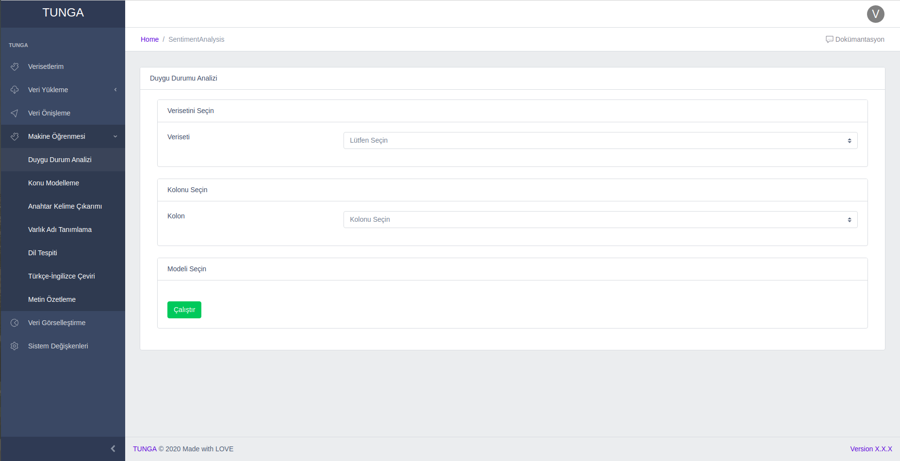
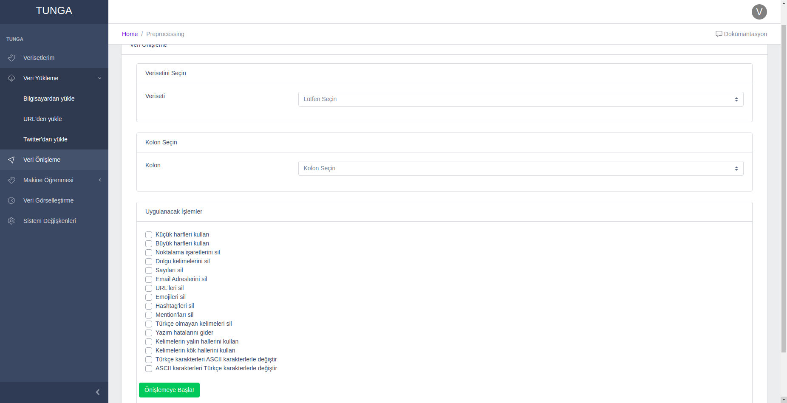
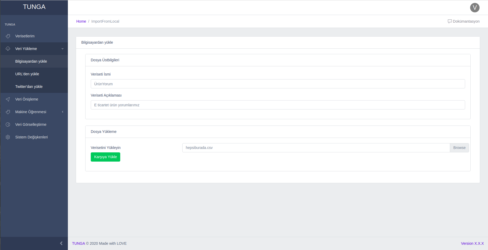
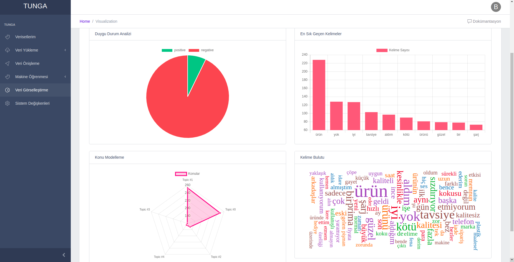

# Tunga Frontend
Tunga ön yüz uygulaması CoreUI isimli ReactJS teması üzerinde geliştirilmiştir. 

## İçindekiler

- [Tunga Frontend](#tunga-frontend)
  - [İçindekiler](#i̇çindekiler)
  - [Kullanılan Teknolojiler](#kullanılan-teknolojiler)
  - [Ekran Görüntüleri](#ekran-görüntüleri)
  - [Kurulum](#kurulum)

## Kullanılan Teknolojiler

* [CoreUI Free React.js Admin Template](https://github.com/coreui/coreui-free-react-admin-template): Projenin ihtiyaç duyduğu frontend altyapısı ve genel css özellikleri bu kütüphaneden alınmıştır.

* [Mobx](https://mobx.js.org): React uygulamasının durumlarınının (state) tutulduğu state container yapısıdır.


* [Superagent](https://visionmedia.github.io/superagent/): React uygulamasından web servise istek atmak için kullanılan kütüphanedir.

## Ekran Görüntüleri
<div align="center">
</img>

</img>

</img>

</img>
</div>

## Kurulum

Projeyi docker kullanarak kendi bilgisayarınızda çalışıtrabilirsiniz. Bunun için aşağıdaki komutu çalıştırmanız yeterlidir.

```bash
docker run -it --rm -p 3000:80 tahtaciburak/tunga-frontend:v1
```
